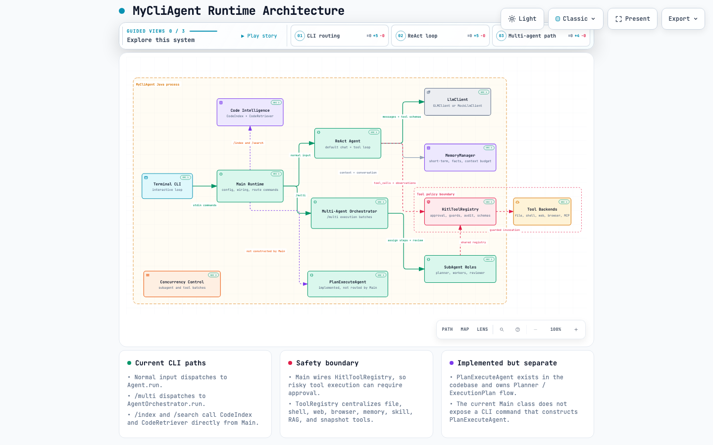

# MyCliAgent

> A terminal-first AI agent runtime built in Java 17.
> Designed to make agent reasoning, tool execution, memory, planning and safety visible from the command line.

MyCliAgent 是一个从零实现的命令行 AI Agent 框架。它把 ReAct 工具调用、Plan-and-Execute、多 Agent 协作、代码库 RAG、记忆管理、人工审批和安全工具边界组织成一套可运行、可演示、可扩展的 Java 工程。

MyCliAgent is a Java 17 command-line AI Agent framework built from scratch. It combines ReAct tool use, Plan-and-Execute workflows, multi-agent orchestration, codebase RAG, memory management, human approval and safe tool boundaries into a runnable engineering project.

## Architecture



Open the generated runtime architecture diagram:

- [Interactive Archify diagram](https://raw.githack.com/Rishi-Mishima/java-cli/main/archify/paicli-runtime-architecture.html)
- [Archify source spec](archify/paicli-runtime-architecture.json)

The runtime is organized around a terminal entry point, a mode-routing layer, and shared service boundaries:

| Runtime area | Responsibility |
| --- | --- |
| **Terminal CLI** | Reads interactive commands and routes normal input, `/multi`, `/index`, `/search`, `clear` and `exit`. |
| **Main Runtime** | Loads `.env`, creates the `LlmClient`, wraps tools with HITL, and wires `Agent` and `AgentOrchestrator`. |
| **ReAct Agent** | Handles normal chat input through model calls, tool calls, observations, memory updates and final answers. |
| **Multi-Agent Orchestrator** | Handles `/multi` by coordinating planner, worker and reviewer `SubAgent` roles. |
| **Code Intelligence** | Handles `/index` and `/search` directly from Main with `CodeIndex` and `CodeRetriever`. |
| **LlmClient** | Keeps provider-specific chat and tool-call formatting behind a stable interface. |
| **MemoryManager** | Supplies retrieved context and stores conversation entries, facts, tool results and token usage. |
| **HitlToolRegistry** | Exposes tool schemas to the model and gates risky execution through guards, approval and audit logging. |
| **PlanExecuteAgent** | Exists as an implemented planning runtime, but the current `Main` class does not route a CLI command to it. |

Current CLI data flow:

```text
Terminal CLI
  -> Main Runtime
  -> normal input: ReAct Agent -> LlmClient / MemoryManager / HitlToolRegistry
  -> /multi: Multi-Agent Orchestrator -> SubAgent roles -> shared LlmClient / HitlToolRegistry
  -> /index or /search: CodeIndex / CodeRetriever
```

## Highlights

| Layer | What it shows | 面试中可以讲什么 |
| --- | --- | --- |
| **Reasoning Runtime** | ReAct loop with multi-turn tool calls and observations | 如何让模型从“聊天”变成“能行动的执行器” |
| **Planning Runtime** | Plan-and-Execute with task graphs, review hooks and replanning | 如何处理长任务、依赖关系、失败恢复和执行顺序 |
| **Multi-Agent System** | Planner, workers and reviewer coordinated by an orchestrator | 如何设计角色分工、并发批次、评审重试和结果汇总 |
| **Code Intelligence** | `/index` + hybrid code search backed by chunks, relations and SQLite | 如何让 Agent 理解当前代码库，而不是盲目读全量文件 |
| **Tool Safety Boundary** | Centralized ToolRegistry with path, command, browser and approval guards | 如何限制 Agent 的操作范围，并留下可审计的执行路径 |
| **Memory Layer** | Short-term conversation memory, long-term facts and context budgeting | 如何在有限上下文窗口里保留有用信息 |
| **Terminal UX** | JLine input, inline rendering, status display and folded tool output | 如何让 CLI Agent 的思考、调用和结果对用户可见 |
| **Demo Path** | Mock provider, GLM provider and Maven test profiles | 如何让项目在没有 API Key 的情况下仍然可运行、可评审 |


## Tech Stack

| Area | Choices |
| --- | --- |
| Language / Build | Java 17, Maven |
| LLM Runtime | GLM API, mock provider, provider-agnostic `LlmClient` |
| Data / Protocols | Jackson, OkHttp, Jsoup |
| Terminal UI | JLine, Lanterna, ANSI renderer |
| Code Intelligence | JavaParser, SQLite JDBC, custom chunking and retrieval |
| Safety / Recovery | HITL handlers, guards, audit log, JGit snapshot foundation |
| Testing | JUnit 5, Mockito, MockWebServer |

## Quick Start

The default path is optimized for demos: build once, run locally, no paid model required.

### 1. Build

```bash
mvn -q package
```

By default, `package` skips tests so the CLI artifact can be built quickly for manual demo.

### 2. Run in mock mode

```bash
java -jar target/MyCliAgent-1.0-SNAPSHOT.jar
```

Mock mode is the default. It does not require an external API key and is suitable for interviews or local demos.

### 3. Run with GLM

Create or edit `.env`:

```text
LLM_PROVIDER=glm
GLM_API_KEY=your_glm_api_key_here
HITL_ENABLED=true
```

Then run:

```bash
java -jar target/MyCliAgent-1.0-SNAPSHOT.jar
```

## CLI Usage

After startup, the CLI enters an interactive loop. The main demo paths are:

| Goal | Command |
| --- | --- |
| Basic conversation | `你好，请介绍一下你自己` |
| ReAct tool calling | `请读取 README.md，并总结这个项目` |
| Build code index | `/index` |
| Search indexed code | `/search ToolRegistry 如何保护文件路径` |
| Run multi-agent workflow | `/multi 分析这个项目的架构，并找出三个可以优化的点` |
| Clear conversation | `clear` |
| Exit CLI | `exit` |

## Execution Model

```text
ReAct mode
User request -> Agent -> LLM -> ToolRegistry -> observation -> LLM -> answer

Plan mode
Goal -> Planner -> ExecutionPlan -> executable batches -> tools/subtasks -> final synthesis

Multi-agent mode
Goal -> planner SubAgent -> worker pool -> reviewer SubAgent -> orchestrated result
```

## Design Principles

| Principle | How it appears in the codebase |
| --- | --- |
| **The model is replaceable** | `LlmClient` isolates provider-specific request and response formats. |
| **Tools are explicit contracts** | `ToolRegistry` owns tool metadata, schemas, execution and audit behavior. |
| **Context is a budget** | Memory retrieval and history compaction keep prompts within model limits. |
| **Risky actions need boundaries** | Path guards, command guards, browser guards and HITL approval sit before execution. |
| **Large tasks need structure** | Plan-and-Execute turns open-ended goals into ordered, reviewable task graphs. |
| **Concurrency should stay observable** | Parallel workers buffer output and flush deterministically to the terminal. |

## Module Structure

```text
src/main/java/com/mycliagent
├── agent      # ReAct Agent, PlanExecuteAgent, multi-agent orchestration, streaming, token budget
├── browser    # browser mode and browser audit metadata
├── cli        # command-line entry point and runtime config loading
├── context    # model/context profile configuration
├── hitl       # human-in-the-loop approval flow
├── llm        # LlmClient abstraction, GLM client, mock client
├── memory     # conversation memory, long-term memory, retrieval, compression, token budget
├── plan       # execution plan, task model, planner
├── prompt     # prompt assembly, project memory loading, prompt modes
├── rag        # code chunking, indexing, embeddings, vector store, hybrid search
├── render     # plain and inline terminal renderers
├── runtime    # cancellation token/context
├── skill      # skill registry and skill context loading
├── tool       # tool registry, guards, web fetch/search, snapshots, audit log, LSP manager
└── util       # ANSI style and Chinese tokenizer helpers
```

## Core Design

### 1. Provider Abstraction

The agent depends on `LlmClient` instead of a concrete model SDK.

This makes the runtime independent from GLM and keeps the system open for future OpenAI-compatible providers. The mock implementation also allows reviewers to run the project without credentials.

```text
LlmClient
├── GLMClient
└── MockLlmClient
```

### 2. Tool Registry as a Safety Boundary

`ToolRegistry` is the single place where tools are registered, described, validated and executed.

Current tool categories include:

- file tools: `read_file`, `write_file`, `list_dir`, `glob_files`, `grep_code`
- command tools: `execute_command`, `create_project`
- code intelligence: `search_code`
- web tools: `web_search`, `web_fetch`
- browser tools: `browser_connect`, `browser_disconnect`, `browser_status`
- memory and skill tools: `save_memory`, `load_skill`
- recovery tools: `revert_turn`

Safety-related mechanisms include:

- path normalization and project-root restriction through `PathGuard`
- command validation through `CommandGuard`
- browser operation validation through `BrowserGuard`
- audit logging for sensitive tool calls
- optional HITL approval before risky operations
- file write size limit to avoid accidental large writes

### 3. ReAct Execution Loop

`Agent` implements the core ReAct loop:

```text
1. Store user input in memory.
2. Retrieve relevant long-term memory.
3. Rebuild the system prompt with memory, project context and skill index.
4. Send messages and tool definitions to the LLM.
5. Execute tool calls through ToolRegistry.
6. Append tool observations back into the conversation.
7. Continue until the model returns a final answer.
8. Stop early on cancellation, budget exhaustion or loop protection.
```

### 4. Plan-and-Execute

`PlanExecuteAgent` is built for larger tasks that benefit from planning before acting.

It supports:

- planner-generated JSON execution plans
- task dependency graph
- executable task detection
- parallel execution for independent tasks
- plan review hook
- replanning on early failure
- history compression during long runs

### 5. Multi-Agent Collaboration

`AgentOrchestrator` implements a simple but interview-friendly multi-agent workflow:

```text
planner -> workers -> reviewer -> final summary
```

Independent steps in the same dependency batch can run concurrently. Each worker writes to an isolated output buffer, and the orchestrator flushes results in deterministic order to avoid messy terminal output.

### 6. Code RAG

The RAG subsystem is designed for project-aware code questions:

```text
CodeIndex
  -> collect source files
  -> chunk code
  -> generate embeddings
  -> analyze Java symbol relations
  -> persist chunks and relations to SQLite

CodeRetriever
  -> combine vector search and keyword/symbol search
  -> format ranked results for CLI
```

This allows the CLI to answer questions about the current repository without reading the entire codebase into context.

### 7. Memory and Context Budget

`MemoryManager` separates:

- short-term conversation memory
- long-term fact memory
- context retrieval
- token usage tracking
- context profile configuration

`ConversationHistoryCompactor` provides an additional safeguard when the active conversation approaches the model context limit.

## Human-in-the-Loop

Risky operations can go through a human approval layer:

```text
Agent / PlanExecuteAgent / SubAgent
  -> HitlToolRegistry
  -> HitlHandler
  -> TerminalHitlHandler
```

This is useful in interviews because it shows that the agent is not only capable of acting, but also designed with operational control in mind.

## Testing

Run quick regression tests:

```bash
mvn test -Pquick
```

Run the phase 16 smoke test profile:

```bash
mvn test -Pphase16-smoke
```

Run package with tests explicitly enabled:

```bash
mvn -q package -DskipTests=false
```

Existing tests cover concurrency-sensitive areas such as:

- `ToolRegistryConcurrencyTest`
- `AgentOrchestratorConcurrencyTest`
- `PlanExecuteAgentConcurrencyTest`
- `RagSmokeTest`


## License

Add an open-source license such as MIT or Apache 2.0 before publishing this project publicly.
